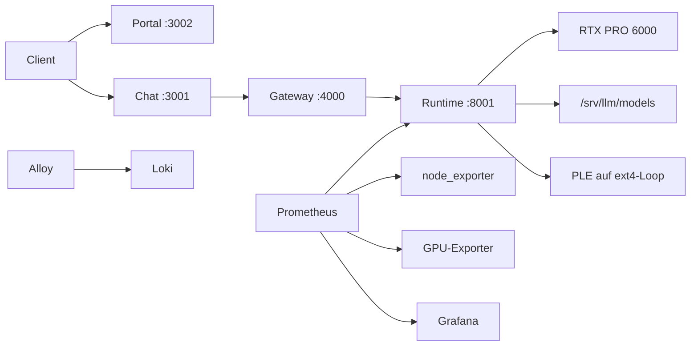

# Lokale LLM-Infrastruktur

Ein Rechner, ein Sprachmodell, kein Cloud-Zugang. CachyOS, rootless Podman,
ZFS, Pennyroyal/SGLang, Qwen3.8 Flash Next.

## Fuer den Einstieg

```bash
./setup.sh          # alles einrichten, wiederholbar
./scripts/doctor.sh # gefuehrte Diagnose mit konkreten Befehlen
```

Wer nur lesen will, findet unter [Installation](install.md) die Reihenfolge und
unter [Architektur](architecture.md), welche Bauteile wie zusammenspielen.

## Seiten

| Seite | Fuer wen |
|---|---|
| [Architektur](architecture.md) | Verstaendnis: Netze, Speicher, Schluessel, Ablaufpfade |
| [Installation](install.md) | erster Aufbau auf einem Rechner |
| [Betrieb](operations.md) | taegliche Arbeit, Start/Stopp, Updates, Neustart |
| [Beobachtung](monitoring.md) | Metriken, Dashboards, Alarme, Protokolle |
| [Sicherheit](security.md) | Bindungen, Passwoerter, bekannte Kompromisse |
| [Sicherung und Wiederherstellung](backup-restore.md) | Backup, Rueckgabe, Test |
| [Fehlerbilder](troubleshooting.md) | Meldung -> Ursache -> Befehl |
| [Geschwindigkeit](performance.md) | Messungen, PCIe-Grenze, richtig messen |
| [Status](status.md) | was erledigt ist, was offen bleibt |
| [Entscheidungen (ADR)](adr/0001-use-rootless-podman.md) | warum etwas so gebaut wurde |

## Wo die Programme laufen

| Adresse | Inhalt |
|---|---|
| http://127.0.0.1:3002 | Portal (Homepage) - Einstieg fuer Menschen |
| http://127.0.0.1:3001 | Chat (Open WebUI) |
| http://127.0.0.1:4000 | Gateway (LiteLLM) - eine Adresse, ein Schluessel |
| http://127.0.0.1:8001 | Runtime (Pennyroyal) - nur fuer Diagnose |
| http://127.0.0.1:3000 | Grafana-Dashboards |
| http://127.0.0.1:9090 | Prometheus |
| http://127.0.0.1:8080 | Dozzle (Live-Protokolle) |

Alle Adressen sind nur auf dem Rechner selbst erreichbar.



## Englischsprachige Kurzfassung

The repository brings up a local LLM stack on CachyOS: rootless Podman Quadlets
for the SGLang runtime, LiteLLM gateway, Open WebUI, PostgreSQL and an
observability plane (Prometheus, Grafana, Loki, Alloy, Dozzle, node and GPU
exporters). See `docs/en/index.md`.
