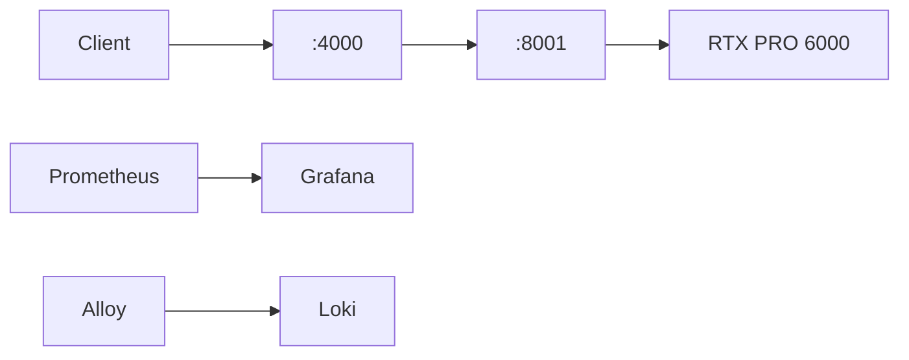

# LLM Infrastructure

Diese Dokumentation beschreibt das reproduzierbare Setup für RTX PRO 6000, ZFS, Podman, Pennyroyal/SGLang, LiteLLM und Observability.

## Schnellstart

```bash
make validate
make preflight
llmctl status
```

Die eigentliche Hostausführung folgt der Reihenfolge in [Installation](install.md). Geheimnisse bleiben außerhalb von Git.


